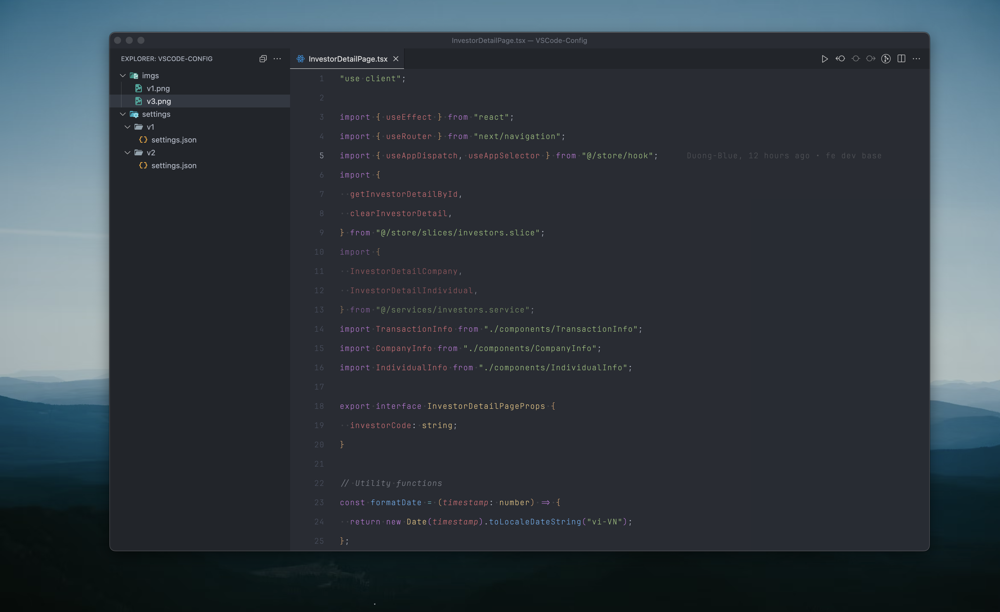
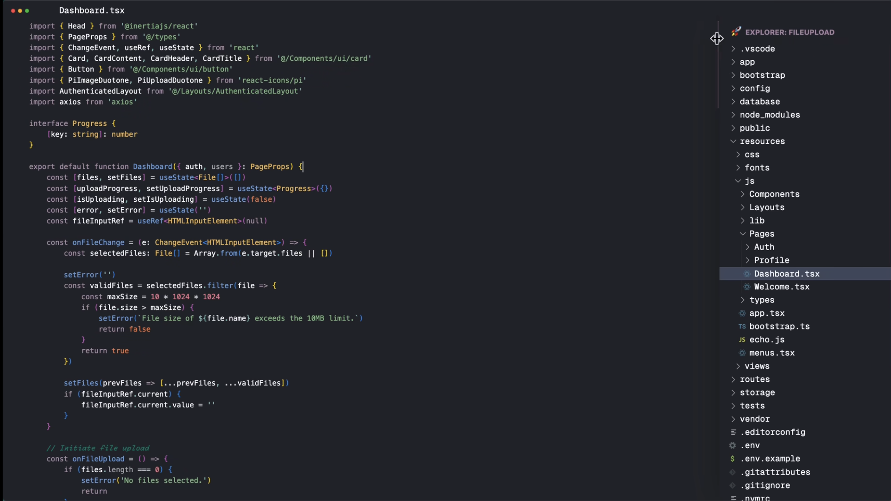

  

# VSCode Config Review

<table align="center">
  <tr>
    <td align="center">
      
       <b>v1: Vibrancy</b>
    </td>
    <td align="center">
      
       <b>v2: Minimal</b>
    </td>
    <td align="center">
      
       <b>v3: Custom CSS/JS</b>
    </td>
  </tr>
</table>

## Tổng quan

Repo cung cấp các cấu hình VSCode đẹp, tối ưu cho macOS:

- **v1**: Hiệu ứng mờ (vibrancy), tuỳ chỉnh sâu.
- **v2**: Tối giản, tinh tế, tập trung vào trải nghiệm code.
- **v3**: Tuỳ biến giao diện sâu bằng CSS/JS, cần extension đặc biệt.

> Xem hướng dẫn chi tiết cho v3 tại đây: [Hướng dẫn cấu hình v3](./settings/v3/README-vi.md)

| Thiết lập chính        | v1 (Vibrancy)               | v2 (Tối giản)               | v3 (Custom CSS/JS)               |
| ---------------------- | --------------------------- | --------------------------- | -------------------------------- |
| Giao diện              | One Dark Pro, Material Icon | One Dark Pro, Material Icon | React Theme, Material Icon       |
| Hiệu ứng mờ (vibrancy) | Có (đẹp nhất trên macOS)    | Không                       | Tuỳ biến sâu (CSS/JS)            |
| Font                   | JetBrains Mono              | JetBrains Mono              | Geist Mono, JetBrains Mono       |
| Formatter              | Prettier, cpptools          | Prettier, cpptools          | Prettier, Intelephense, cpptools |
| Tuỳ chỉnh giao diện    | Rất nhiều                   | Đủ dùng, gọn                | Toàn diện qua CSS/JS             |

## Font đề xuất

- **JetBrains Mono:** [Tải tại đây](https://www.jetbrains.com/lp/mono/)
- **Geist Mono:** [Tải tại đây](https://vercel.com/font/geist-mono)

## Extensions nên cài cho từng phiên bản

> Xem chi tiết và copy nhanh tại [`extensions/extensions.json`](./extensions/extensions.json)
