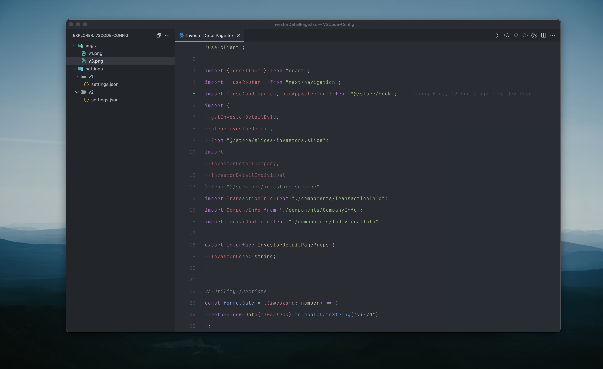
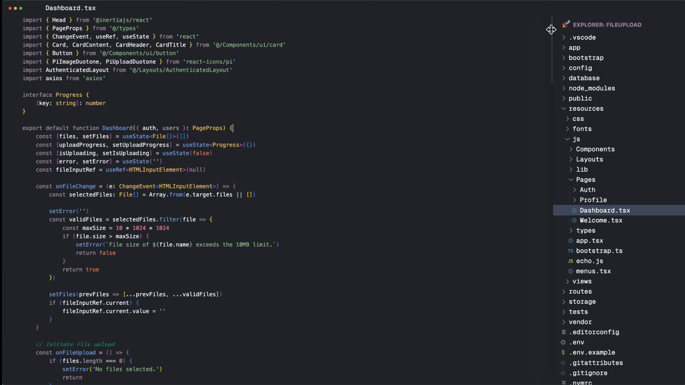

  <em>"Minimalist isn't lack of something, it's the perfect amount of everything."</em>

[**V3.0 Stable**](https://github.com/nguyentuanminh) • [**Setup Guide**](./README-vi.md) • [**Premium Fonts**](./MyFonts)

---

### ✦ Showcase ✦

<table align="center">
  <tr>
    <td align="center">
      
       
      <code>MINIMAL SUITE</code>
    </td>
    <td align="center">
      
       
      <code>ADVANCED SUITE</code>
    </td>
  </tr>
</table>

 

---

### ✦ The Philosophies ✦

| MINIMAL | ADVANCED |
| :--- | :--- |
| **Focus** • Pure performance | **Aesthetics** • Glassmorphism |
| **Effect** • Smooth Cursor Trail | **Effect** • Deep UI Customization |
| **Font** • JetBrains Mono | **Font** • MonoLisa / Dank Mono |
| `index.js` driven | `CSS/JS Loader` driven |

 

---

### ✦ Installation ✦

1.  **Select the Edition:** 
    *   Choose [`settings/minimal`](./settings/minimal) for high-speed coding.
    *   Choose [`settings/advanced`](./settings/advanced) for visual perfection.
2.  **Apply the Configuration:** Copy `settings.json` content to your VSCode.
3.  **The Integration:**
    *   Install **Custom CSS & JS Loader**.
    *   Inject the provided `index.js` or `custom.css` paths.
    *   `Cmd+Shift+P` ➜ `Enable Custom CSS and JS`.

 

---

### ✦ Core Artifacts ✦

  
  
  
  

---

  
   
  Crafted by <b>Soren Nguyen</b>

